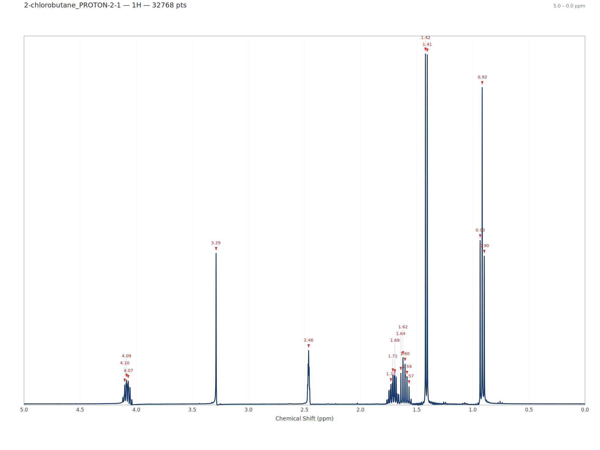

# NMR Spectral Processing GUI

> It's a piece of vibe coded hotmess that mostly works (for me atleast)

A desktop NMR spectral processing app written in Rust with [egui](https://github.com/emilk/egui). Drag in your FID, click some buttons, get a spectrum. Every single operation is logged so you (or your PI) can reproduce exactly what happened.

NMRPipe can be used as a backend, but the app runs perfectly fine without it using built-in Rust implementations..... or does it? 



---

## Platforms

| OS | Architecture | Status |
|---|---|---|
| 🐧 Linux | x86_64 | ✅ Primary dev platform |
| 🪟 Windows | x86_64 | ✅ Builds via CI |
| 🍎 macOS | Apple Silicon (aarch64) | ✅ Builds via CI |

Pre-built binaries are attached to [Releases](../../releases) when a version tag is pushed. Otherwise, build from source.

---

## Features

### What it does
- **Auto-detection** — figures out the vendor format and converts to NMRPipe internally, probably
- **1D processing** — apodization (EM, GM, sine/cosine bell), zero fill, FFT, phase correction, baseline correction, solvent suppression
- **2D contour plots** — NOT YET 
- **Interactive phasing** — click-and-drag PH0/PH1, or hit auto-phase and hope for the best
- **Peak detection** —
- **Integration regions** — 
- **Multiplet detection** — this one is meh
- **Export** — PNG or SVG image with live preview that sometimes works, plus CSV/TSV data export (EXPORT TO SVG, PNG LOOKS ASS)
- **Save/Load projects** — 
- **Reproducibility log** — every operation is recorded with timestamps and NMRPipe-equivalent commands; exportable as text, JSON, or an executable shell script

### Processing pipeline

| Operation | Description | NMRPipe Equivalent |
|---|---|---|
| Apodization | EM, GM, Sine Bell, Cosine Bell | `EM`, `GM`, `SP` |
| Zero Fill | Power-of-2 zero filling | `ZF` |
| Fourier Transform | Complex FFT with shift | `FT` |
| Phase Correction | PH0 + PH1, manual or auto | `PS` |
| Baseline Correction | Polynomial baseline subtraction | `POLY` |
| Solvent Suppression | Region zeroing with smooth edges | `SOL` |

---

## Building from source

### Prerequisites

- [Rust](https://rustup.rs/) (1.75+ recommended)
- On **Linux**: some system libs for the GUI framework:
  ```bash
  # Debian/Ubuntu
  sudo apt install libgtk-3-dev libxcb-render0-dev libxcb-shape0-dev \
       libxcb-xfixes0-dev libxkbcommon-dev libfontconfig1-dev
  ```
- On **macOS** and **Windows**: nothing extra, just Rust.

### Build

```bash
# Clone
git clone https://github.com/YOUR_USER/NMR-program.git
cd NMR-program

# Release build (do this one, debug is slow)
cargo build --release

# Run it
cargo run --release
```

The binary ends up in `target/release/nmr_gui` (or `nmr_gui.exe` on Windows).

### Cross-compilation note

The GitHub Actions workflow in [.github/workflows/build.yml](.github/workflows/build.yml) handles building for all three platforms automatically. Push a tag like `v0.1.0` to create a release with downloadable binaries.

```bash
git tag v0.1.0
git push origin v0.1.0
```

---

## Usage

1. **Launch** — `cargo run --release` or run the binary directly
2. **Open data** — drag-and-drop a `.jdf` / Bruker / Varian folder onto the window, or File → Open
3. **Process** — use the left panel: apodization → zero fill → FT → phase → baseline
4. **Analyze** — detect peaks, draw integration regions, find multiplets
5. **Export** — go to the Export tab, tweak settings, hit export
6. **Undo** — Ctrl+Z, as many times as you want

---

## NMRPipe integration

Works in two modes:

| Mode | Status bar | What happens |
|---|---|---|
| **NMRPipe installed** | 🟢 NMRPipe | Uses `bruk2pipe`, `var2pipe` for conversion; subprocess calls for processing |
| **Without NMRPipe** | 🟡 Built-in mode | Pure Rust implementations for everything;|

The reproducibility log records NMRPipe-equivalent commands regardless of which mode is used, so the output is always reproducible.

---

## Project structure

```
src/
├── main.rs                     # Entry point
├── app.rs                      # Application state, eframe::App, export rendering
├── data/
│   ├── spectrum.rs             # SpectrumData, AxisParams, core types
│   ├── jdf.rs                  # JEOL Delta (.jdf) native reader
│   └── nmrpipe_format.rs       # NMRPipe format reader/writer
├── pipeline/
│   ├── command.rs              # NMRPipe subprocess abstraction
│   ├── conversion.rs           # Format detection & auto-conversion
│   └── processing.rs           # DSP operations (FT, phase, baseline, etc.)
├── gui/
│   ├── toolbar.rs              # Menu bar & file dialogs
│   ├── pipeline_panel.rs       # Left sidebar processing controls
│   ├── spectrum_view.rs        # 1D spectrum plot (interactive)
│   ├── contour_view.rs         # 2D contour plot
│   ├── phase_dialog.rs         # Interactive phase correction
│   ├── export_tab.rs           # Export settings + live preview
│   ├── export_dialog.rs        # Export settings types
│   ├── conversion_dialog.rs    # Conversion settings UI
│   └── theme.rs                # Light / Cyberpunk themes
└── log/
    └── reproducibility.rs      # Logging system
```

## Tech stack

| Component | Crate |
|---|---|
| GUI | `eframe` / `egui` 0.31 |
| Plotting | `egui_plot` 0.31 |
| FFT | `rustfft` |
| Image export | `image` |
| Serialization | `serde` + `serde_json` |
| File dialogs | `rfd` |

---

## License

MIT

---

> *Is it good? No. Does it work? Mostly. Will it corrupt your data? Probably not.
